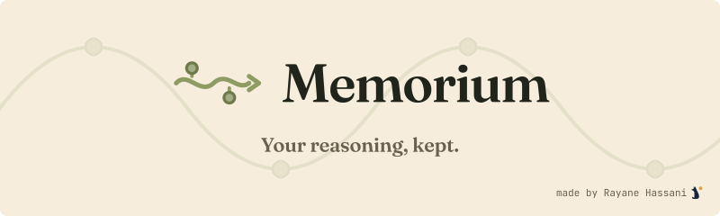

<p align="center">
  
</p>

# Memorium

**Your reasoning, kept.** A forensic journal of every Claude Code session.

Six months from now, the commit will say *what* changed. Memorium shows you *why*: the session where the trade-off was weighed, the benchmark that settled it, the dead end you already tried.

[](https://github.com/RayaneHassani/memorium/actions/workflows/ci.yml)
[](LICENSE)

- **Find the why.** Full-text search across every session you ever ran, prebuilt at export time. Type `postgres`, land on the session where you chose it.
- **Keep it.** Claude Code deletes sessions after 30 days. Memorium archives the raw logs the moment a session ends and restores them so `claude --resume` works again.
- **Make it yours.** Highlight, comment, rename and regroup sessions. Your source logs are never touched.

## Quick start

```bash
pipx install git+https://github.com/RayaneHassani/memorium
memorium          # reads ~/.claude/projects, writes ./export, opens the browser
memorium init     # once: stop the 30-day purge and archive every session as it ends
```

No server, no database, no account. One Python file, standard library only, and a static site you can open anywhere, even on a plane.

## Features

- **Readable transcripts.** Prompts, answers, tool calls and terminal output, typeset for long-form reading.
- **Full-text search** across every session, from a search index built once at export.
- **Highlights and comments** in five colours, with a margin view and a per-session recap.
- **Logical organization.** Rename sessions and folders, move sessions between folders.
- **A dashboard that remembers.** Weekly activity and the latest sessions of every project.
- **Offline by design.** Fonts are embedded in the page, nothing is fetched from the network.

## How it works

`~/.claude/projects` belongs to Claude Code, which indexes it. Renaming a folder or moving a `.jsonl` file there would break `claude --resume`. So every rename and move in Memorium is **logical only**: it is recorded in a separate `export/data/metadata.json` and resolved at display time. The source of truth is never mutated, and every change is reversible. This is the core architectural trade-off, chosen deliberately over reorganizing files on disk.

Writing that metadata needs the browser's File System Access API, which is disabled on `file://` pages. `memorium serve` serves the export over `http://localhost`, a *secure context*, with a plain static file server and no logic on the server side. Read-only browsing works from `file://` in any browser; annotations and organization need `memorium serve` and a Chromium browser (Chrome, Edge, Brave).

## Archive and restore

Claude Code silently deletes any session untouched for `cleanupPeriodDays`, **30 days by default**. `memorium init` raises that setting (after backing up your `settings.json`) and installs a `SessionEnd` hook that archives every session the moment it ends.

```bash
memorium archive                      # gzip every raw session into ~/.memorium/archive, incremental
memorium restore <id-prefix>          # put one back into ~/.claude/projects, so `claude --resume` works
memorium restore <id-prefix> --force  # overwrite a session that diverged locally
```

`restore` also moves a session to another machine, or brings back one Claude Code has already purged. Set `MEMORIUM_ARCHIVE_DIR` to archive elsewhere.

To update, upgrade and re-run in the same output directory. Only the generated pages are rewritten; your `export/data/` is never touched.

```bash
pipx upgrade memorium-cli && memorium
```

## By the numbers

- **2,424 lines, one file, zero dependencies**: CLI, HTML generator, search index and viewer.
- **61 sessions exported in 1.5 s** from a real multi-month history (718 raw log files scanned).
- **241 KB** for the whole app shell, embedded fonts included.
- **CI on Python 3.8 to 3.13** on every push: byte-compile and a smoke test on a fixture corpus.

## Development

```bash
python export.py                    # same as the installed command
python -m unittest discover -s tests
```

## License

MIT, see [LICENSE](LICENSE). The embedded fonts (Fraunces, Atkinson Hyperlegible Next, JetBrains Mono) are under the SIL Open Font License, see [OFL.txt](OFL.txt).
